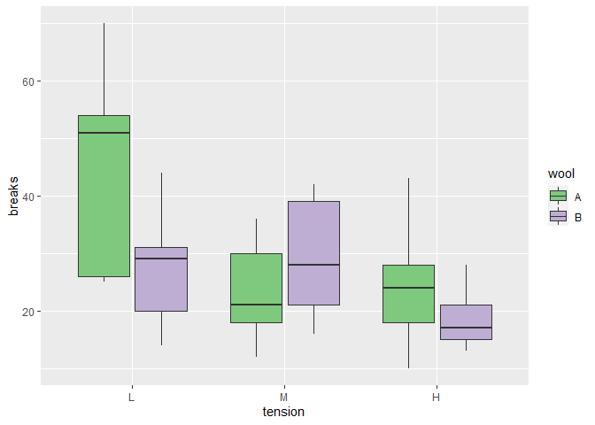

DP_week5
================
Cátia Reis
2022-06-14

-   [Data visualization](#data-visualization)
    -   [Marriage between 3 columns](#marriage-between-3-columns)
    -   [The break-up](#the-break-up)
    -   [Plot](#plot)

## Data visualization

Here are our beloved packages (bibliography in the previous reports).

``` r
library(dslabs)
library(knitr)
library(tidyverse)
library(tidyr)
```

Here is my dataset of interest for this practical. I was looking for a
fun dataset on the web but, I was getting lost in searching. Thus, I
ended up choosing one of r’s datasets named “warpbreaks”.

First, let’s load it.

``` r
data(warpbreaks)
```

To understand this dataset, we need a bit of knowledge on weaving to
understand what the variables represent.

This picture shows you what is meant by a warp.

Source: By Alfred Barlow, Ryj, PKM - Adapted from The History and
Principles of Weaving by Hand and by Power by , 1878, S. Low, Marston,
Searle & Rivington, London., CC BY-SA 3.0,
<https://commons.wikimedia.org/w/index.php?curid=94725908>

Here is its structure.

``` r
str(warpbreaks)
```

    ## 'data.frame':    54 obs. of  3 variables:
    ##  $ breaks : num  26 30 54 25 70 52 51 26 67 18 ...
    ##  $ wool   : Factor w/ 2 levels "A","B": 1 1 1 1 1 1 1 1 1 1 ...
    ##  $ tension: Factor w/ 3 levels "L","M","H": 1 1 1 1 1 1 1 1 1 2 ...

In this dataset, we find 1 numerical variable and 2 factor variables.
The break is the number of breaks in a warp. There are two types of wool
(A or B). And finally, there are three levels of tension which are low
(L), medium (M) and high (H).

``` r
warpbreaks_long <- warpbreaks %>% 
  pivot_longer(breaks, names_to = "variable")
warpbreaks_long %>% kable()
```

| wool | tension | variable | value |
|:-----|:--------|:---------|------:|
| A    | L       | breaks   |    26 |
| A    | L       | breaks   |    30 |
| A    | L       | breaks   |    54 |
| A    | L       | breaks   |    25 |
| A    | L       | breaks   |    70 |
| A    | L       | breaks   |    52 |
| A    | L       | breaks   |    51 |
| A    | L       | breaks   |    26 |
| A    | L       | breaks   |    67 |
| A    | M       | breaks   |    18 |
| A    | M       | breaks   |    21 |
| A    | M       | breaks   |    29 |
| A    | M       | breaks   |    17 |
| A    | M       | breaks   |    12 |
| A    | M       | breaks   |    18 |
| A    | M       | breaks   |    35 |
| A    | M       | breaks   |    30 |
| A    | M       | breaks   |    36 |
| A    | H       | breaks   |    36 |
| A    | H       | breaks   |    21 |
| A    | H       | breaks   |    24 |
| A    | H       | breaks   |    18 |
| A    | H       | breaks   |    10 |
| A    | H       | breaks   |    43 |
| A    | H       | breaks   |    28 |
| A    | H       | breaks   |    15 |
| A    | H       | breaks   |    26 |
| B    | L       | breaks   |    27 |
| B    | L       | breaks   |    14 |
| B    | L       | breaks   |    29 |
| B    | L       | breaks   |    19 |
| B    | L       | breaks   |    29 |
| B    | L       | breaks   |    31 |
| B    | L       | breaks   |    41 |
| B    | L       | breaks   |    20 |
| B    | L       | breaks   |    44 |
| B    | M       | breaks   |    42 |
| B    | M       | breaks   |    26 |
| B    | M       | breaks   |    19 |
| B    | M       | breaks   |    16 |
| B    | M       | breaks   |    39 |
| B    | M       | breaks   |    28 |
| B    | M       | breaks   |    21 |
| B    | M       | breaks   |    39 |
| B    | M       | breaks   |    29 |
| B    | H       | breaks   |    20 |
| B    | H       | breaks   |    21 |
| B    | H       | breaks   |    24 |
| B    | H       | breaks   |    17 |
| B    | H       | breaks   |    13 |
| B    | H       | breaks   |    15 |
| B    | H       | breaks   |    15 |
| B    | H       | breaks   |    16 |
| B    | H       | breaks   |    28 |

### Marriage between 3 columns


Let’s put together all the columns we have with the`unite()` function.

``` r
 warpbreaks_just_married<- warpbreaks%>%unite(unified)
```

Usually, I think together we are stronger, but in this case, putting the
columns together doesn’t seem to make much sense.

### The break-up


It turns out, they weren’t happy together. Let’s work on separating them
with the `separate()`function. I should have known better, the name of
the dataset was warp**breaks**. They were obviously meant to break up
:’( But oh well, sometimes it’s for the better.

``` r
warpbreaks_divorced<-warpbreaks_just_married %>% separate(unified, into=c("breaks","wool", "tension"), sep="_")
head(warpbreaks_divorced)
```

    ##   breaks wool tension
    ## 1     26    A       L
    ## 2     30    A       L
    ## 3     54    A       L
    ## 4     25    A       L
    ## 5     70    A       L
    ## 6     52    A       L

### Plot

Let’s create a plot with our warpbreaks dataset. Let’s plot wool and
breaks to see the difference of breaks whether it’s A or B.

``` r
ggplot(warpbreaks,aes(tension,breaks,fill=wool)) + geom_boxplot() +  scale_fill_brewer(palette="Accent")
```

<!-- -->

It seems wool “A” has the most breaks when the tension is low. I would
have thought it would break when the tension is low.
