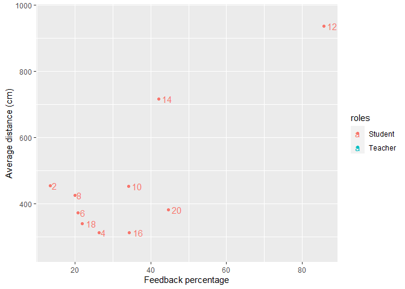
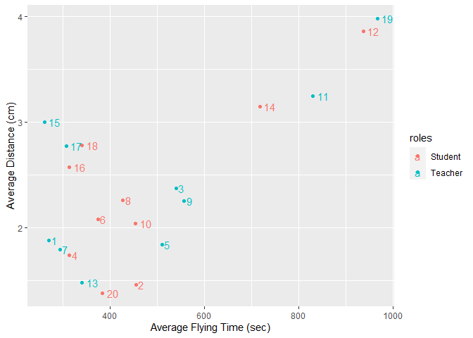

DP_week6
================
Cátia Reis
06/04/2022

-   [Paper planes experiment](#paper-planes-experiment)
    -   [Loading the dataset](#loading-the-dataset)
-   [References](#references)

## Paper planes experiment

### Loading the dataset

For this week’s report, the dataset I will take is from an experiment
that I did with Bastien Nespolo for a class called “Coordination,
representations, communication.” We had a condition in which a
participant (later, the teacher) would learn how to do a paper plane.
The other condition, the teacher had to teach another participant (the
student) how to do the paper plane. Finally, we measured the performance
of the flight by collecting their time and distance of flight of the
paper [planes](https://youtu.be/FlE7mRZImuQ?t=48).

``` r
library(dplyr)
library(ggplot2)
```

Let’s load the dataset from the csv file that we have in the week6’s
folder:

``` r
coordination<-read.table(file="coordination.csv", header=TRUE, sep=";",dec=",") 
```

``` r
str(coordination)
```

    ## 'data.frame':    20 obs. of  12 variables:
    ##  $ participants       : int  1 2 3 4 5 6 7 8 9 10 ...
    ##  $ roles              : chr  "Teacher" "Student" "Teacher" "Student" ...
    ##  $ distance1          : int  180 405 760 420 540 310 220 500 580 410 ...
    ##  $ distance2          : int  270 420 430 240 580 230 450 550 610 430 ...
    ##  $ distance3          : int  360 540 430 280 410 580 210 230 480 520 ...
    ##  $ average_distance   : num  270 455 540 313 510 ...
    ##  $ time1              : num  1.17 0.92 2.66 1.8 2.17 2.11 1.41 2.42 2.23 2.04 ...
    ##  $ time2              : num  2.14 2.4 2.23 1.97 2.17 1.52 2.18 2.15 2.6 2.03 ...
    ##  $ time3              : num  2.33 1.07 2.23 1.46 1.17 2.62 1.78 2.2 1.92 2.04 ...
    ##  $ average_flying_time: num  1.88 1.46 2.37 1.74 1.84 2.08 1.79 2.26 2.25 2.04 ...
    ##  $ learning_time      : num  4 5.65 7.75 8.42 10.83 ...
    ##  $ feedback_percentage: num  NA 13.4 NA 26.3 NA ...

In the coordination dataset, you will find 7 numerical variables, 4
integer variables and 1 character variable.

**Question 1** : Is there an impact of feedback on the performance of
the paper planes ?

For this, let’s make a plot that allows us to visualize both distance
and feedback percentage.

``` r
ggplot(coordination, aes(feedback_percentage, average_distance, colour=roles,label=rownames(coordination))) + geom_point() + labs(y = "Average distance (cm)", x = "Feedback percentage")+  geom_text(hjust = -0.4) 
```

    ## Warning: Removed 10 rows containing missing values (geom_point).

    ## Warning: Removed 10 rows containing missing values (geom_text).

<!-- -->

We have an outlier, **student 12** has one of the best performances and
has one of the highest percentage of feedback. Nevertheless, we do see
there seems to be a tendency where there is a link where the increase of
one increases the other.

**Question 2** : Did the students’ plane do a similar performance as
their teacher’s ?

``` r
ggplot(coordination, aes(average_distance, average_flying_time, colour=roles,label=rownames(coordination))) + geom_point() + labs(y = "Average Distance (cm)", x = "Average Flying Time (sec)") +  geom_text(hjust = -0.4)
```

<!-- -->

We see in this plot that time and distance seem correlated. And to
answer question 2, we can see that it is not always the case that the
teacher does the same performance as the teacher. For example, teacher
19 has both high distance and time while their student (number 20) is
amongst the ‘worse’ performances of our data. On the other hand, we can
see that 17 and 18 or even 15 and 16 did a rather similar performance.

# References

<div id="refs" class="references csl-bib-body hanging-indent">

<div id="ref-wickham_ggplot2_2022" class="csl-entry">

Wickham, Hadley, Winston Chang, Lionel Henry, Thomas Lin Pedersen,
Kohske Takahashi, Claus Wilke, Kara Woo, Hiroaki Yutani, Dewey
Dunnington, and RStudio. 2022. “Ggplot2: Create Elegant Data
Visualisations Using the Grammar of Graphics.”
<https://CRAN.R-project.org/package=ggplot2>.

</div>

</div>
