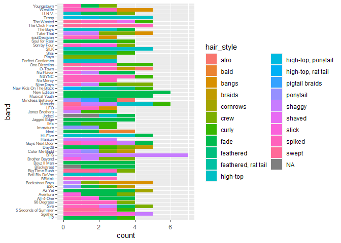

DP_week7
================
Cátia Reis
2022-06-20

-   [Boybands dataset](#boybands-dataset)
    -   [Data types](#data-types)
    -   [Visualizing](#visualizing)
    -   [Hypotheses](#hypotheses)
    -   [Statistics](#statistics)

``` r
library(ggplot2)
library(dplyr)
```

## Boybands dataset

This dataset was used in a [Pudding
article](https://pudding.cool/2018/11/boy-bands/). You canaslo find the
dataset
[here](https://github.com/the-pudding/data/blob/master/boybands/boys.csv).

``` r
boyband<-read.csv("https://raw.githubusercontent.com/the-pudding/data/master/boybands/boys.csv")
str(boyband)
```

    ## 'data.frame':    234 obs. of  18 variables:
    ##  $ band        : chr  "The Click Five" "The Click Five" "The Click Five" "The Click Five" ...
    ##  $ name        : chr  "Joey Zehr" "Ben Romans" "Ethan Mentzer" "Eric Dill" ...
    ##  $ dob         : chr  "5/10/1982" "2/10/1981" "3/15/1982" "2/10/1981" ...
    ##  $ hair_color  : chr  "brown" "brown" "brown" "brown" ...
    ##  $ hair_frosted: chr  "no" "yes" "no" "no" ...
    ##  $ hair_length : chr  "medium" "short" "short" "medium" ...
    ##  $ hair_style  : chr  "swept" "swept" "spiked" "swept" ...
    ##  $ eyes        : chr  "blue" "blue" "blue" "blue" ...
    ##  $ facial_hair : chr  "" "" "" "" ...
    ##  $ accessories : chr  "tie" "tie, bracelet" "tie, earrings" "tie" ...
    ##  $ top_style   : chr  "suit jacket, long-sleeve button down" "suit jacket, long-sleeve button down" "suit jacket, long-sleeve button down" "suit jacket, long-sleeve button down" ...
    ##  $ bottom_style: chr  "dress pants" "dress pants" "dress pants" "dress pants" ...
    ##  $ height      : int  72 NA NA NA NA NA 70 69 68 NA ...
    ##  $ skin        : chr  "light" "light" "light" "light" ...
    ##  $ instrument  : chr  "drums" "keyboard" "bass" "guitar" ...
    ##  $ shirt_color : chr  "blue" "blue" "blue" "blue" ...
    ##  $ jacket_color: chr  "black" "black" "black" "black" ...
    ##  $ bottom_color: chr  "black" "black" "black" "black" ...

``` r
head(boyband) 
```

    ##             band          name       dob hair_color hair_frosted hair_length
    ## 1 The Click Five     Joey Zehr 5/10/1982      brown           no      medium
    ## 2 The Click Five    Ben Romans 2/10/1981      brown          yes       short
    ## 3 The Click Five Ethan Mentzer 3/15/1982      brown           no       short
    ## 4 The Click Five     Eric Dill 2/10/1981      brown           no      medium
    ## 5 The Click Five     Joe Guese 1/14/1982      brown           no      medium
    ## 6          Ideal      Maverick                black           no       short
    ##   hair_style  eyes facial_hair   accessories
    ## 1      swept  blue                       tie
    ## 2      swept  blue             tie, bracelet
    ## 3     spiked  blue             tie, earrings
    ## 4      swept  blue                       tie
    ## 5      swept brown                       tie
    ## 6       fade brown    mustache      flat hat
    ##                              top_style bottom_style height  skin instrument
    ## 1 suit jacket, long-sleeve button down  dress pants     72 light      drums
    ## 2 suit jacket, long-sleeve button down  dress pants     NA light   keyboard
    ## 3 suit jacket, long-sleeve button down  dress pants     NA light       bass
    ## 4 suit jacket, long-sleeve button down  dress pants     NA light     guitar
    ## 5 suit jacket, long-sleeve button down  dress pants     NA light     guitar
    ## 6                  long-sleeve t-shirt  dress pants     NA  dark           
    ##   shirt_color jacket_color bottom_color
    ## 1        blue        black        black
    ## 2        blue        black        black
    ## 3        blue        black        black
    ## 4        blue        black        black
    ## 5        blue        black        black
    ## 6       white                      gray

### Data types

There are only character variables except “height” which is integer.
They are all qualitative nominal while the former is quantitative
discrete. In this dataset you find the “name” of each band member, the
name of the band and then physical characteristics of the members such
as “facial_hair” or which “accessories” they have along with their
“eyes” color, and other ones.

### Visualizing

Our data has some blank spaces, let’s make it clearer for R that there
are NAs.

``` r
boyband1 <- boyband %>% mutate_all(na_if,"")
```

Now that we’ve cleared the blanks, let’s see what our data tells us.
Since we have quite a lot of variables, let’s look at the hair styles
found in the different bands.

``` r
ggplot(boyband1,aes(y=band))+geom_bar(aes(fill=hair_style)) + theme(axis.text.y = element_text(angle = 360, vjust = 0.3, hjust=1,size=6))
```

<!-- -->

Wow! That’s quite a lot of hair styles. BTS, New Edition and Musical
Youth are among the bands in which group members have the same
hairstyles for all members. Then we have *Color Me Badd*, a band in
which the four members have all different hairstyles.

### Hypotheses

-   **H1** : Members from the same boyband are more likely to have the
    same hair style.
-   **H0** : Pertaining to a certain boyband has no impact on your hair
    style.

### Statistics

[Cool statistics song](https://youtu.be/BvWefB4NGGI?t=22)

Let’s use the Chi-squared test because we have categorical data.

``` r
chisq.test(table(boyband1$band,boyband1$hair_style))
```

    ## Warning in chisq.test(table(boyband1$band, boyband1$hair_style)): Chi-squared
    ## approximation may be incorrect

    ## 
    ##  Pearson's Chi-squared test
    ## 
    ## data:  table(boyband1$band, boyband1$hair_style)
    ## X-squared = 1609.3, df = 1026, p-value < 2.2e-16

It seems we can reject the null hypothesis since our p-value is \<0.05.
