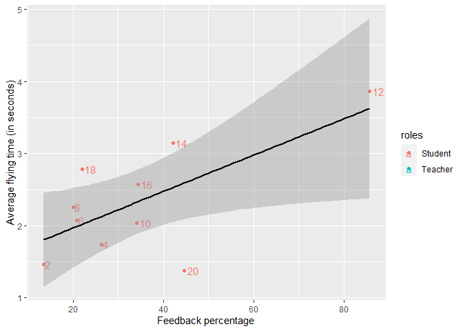

week8_DP
================
Cátia Reis
13/04/2022

## Paper plane experiment

``` r
library(dplyr)
library(ggplot2)
```

### The dataset

We will be looking at the same dataset that we used in [week
6](DP_week6/DP_week6.md).

``` r
coordination<-read.table(file="coordination.csv", header=TRUE, sep=";",dec=",") 
```

#### Reminder

In this experiment, we used a paper plane task to understand if
face-to-face interaction had an impact on learning performance. We had a
**non-interactive condition** where one participant learned to do a
paper plane by themselves by watching a youtube video tutorial. Then,
this same participant taught another participant how to do the paper
plane and this constituted our **interactive condition**. In the
dataset, you can see that there is a “roles” column with two options
(teacher,student). The teacher stands for the non-interactive condition
while the student stands for the interactive condition data. We measured
learning performance by looking at the distance and time the paper
planes did. Finally, we also coded what we consider “feedbacks”. We
considered that the more feedbacks you had in a student-teacher pair,
the more interactive the pair was. Thus, we also hypothesized that the
more interactive a pair was, the better the performance of the student’s
plane would be.

-   Explanatory variables (as named in the dataset) : “roles” and
    “feedback_percentage”
-   Response variables : performance, i.e. “average_flying_time”&
    “average_distance”

### Correlation

``` r
cor.test(coordination$feedback_percentage,coordination$average_flying_time)
```

    ## 
    ##  Pearson's product-moment correlation
    ## 
    ## data:  coordination$feedback_percentage and coordination$average_flying_time
    ## t = 2.5573, df = 8, p-value = 0.03379
    ## alternative hypothesis: true correlation is not equal to 0
    ## 95 percent confidence interval:
    ##  0.07102417 0.91423603
    ## sample estimates:
    ##       cor 
    ## 0.6706595

``` r
cor.test(coordination$feedback_percentage,coordination$average_distance)
```

    ## 
    ##  Pearson's product-moment correlation
    ## 
    ## data:  coordination$feedback_percentage and coordination$average_distance
    ## t = 3.8286, df = 8, p-value = 0.005028
    ## alternative hypothesis: true correlation is not equal to 0
    ## 95 percent confidence interval:
    ##  0.3539228 0.9518884
    ## sample estimates:
    ##      cor 
    ## 0.804316

There is a positive correlation between the two and the p-value is below
0.05 which tells us it is significant. Correlation does not imply
causation.

Now fit your model in a (General) Linear Model (remember the
assumptions)

``` r
general<-lm(coordination$feedback_percentage~coordination$average_distance)
summary(general)
```

    ## 
    ## Call:
    ## lm(formula = coordination$feedback_percentage ~ coordination$average_distance)
    ## 
    ## Residuals:
    ##      Min       1Q   Median       3Q      Max 
    ## -19.6064  -9.3507  -0.1345  10.8848  17.5839 
    ## 
    ## Coefficients:
    ##                               Estimate Std. Error t value Pr(>|t|)   
    ## (Intercept)                   -4.64265   10.98589  -0.423  0.68372   
    ## coordination$average_distance  0.08275    0.02161   3.829  0.00503 **
    ## ---
    ## Signif. codes:  0 '***' 0.001 '**' 0.01 '*' 0.05 '.' 0.1 ' ' 1
    ## 
    ## Residual standard error: 13.04 on 8 degrees of freedom
    ##   (10 observations deleted due to missingness)
    ## Multiple R-squared:  0.6469, Adjusted R-squared:  0.6028 
    ## F-statistic: 14.66 on 1 and 8 DF,  p-value: 0.005028

``` r
general<-glm(coordination$feedback_percentage~coordination$average_distance)
summary(general)
```

    ## 
    ## Call:
    ## glm(formula = coordination$feedback_percentage ~ coordination$average_distance)
    ## 
    ## Deviance Residuals: 
    ##      Min        1Q    Median        3Q       Max  
    ## -19.6064   -9.3507   -0.1345   10.8848   17.5839  
    ## 
    ## Coefficients:
    ##                               Estimate Std. Error t value Pr(>|t|)   
    ## (Intercept)                   -4.64265   10.98589  -0.423  0.68372   
    ## coordination$average_distance  0.08275    0.02161   3.829  0.00503 **
    ## ---
    ## Signif. codes:  0 '***' 0.001 '**' 0.01 '*' 0.05 '.' 0.1 ' ' 1
    ## 
    ## (Dispersion parameter for gaussian family taken to be 169.9509)
    ## 
    ##     Null deviance: 3850.8  on 9  degrees of freedom
    ## Residual deviance: 1359.6  on 8  degrees of freedom
    ##   (10 observations deleted due to missingness)
    ## AIC: 83.502
    ## 
    ## Number of Fisher Scoring iterations: 2

#### Linear model functions

``` r
general<-lm(coordination$feedback_percentage~coordination$average_flying_time)
summary(general)
```

    ## 
    ## Call:
    ## lm(formula = coordination$feedback_percentage ~ coordination$average_flying_time)
    ## 
    ## Residuals:
    ##     Min      1Q  Median      3Q     Max 
    ## -20.393  -8.473  -4.799   4.384  27.315 
    ## 
    ## Coefficients:
    ##                                  Estimate Std. Error t value Pr(>|t|)  
    ## (Intercept)                        -7.296     17.077  -0.427   0.6805  
    ## coordination$average_flying_time   17.856      6.982   2.557   0.0338 *
    ## ---
    ## Signif. codes:  0 '***' 0.001 '**' 0.01 '*' 0.05 '.' 0.1 ' ' 1
    ## 
    ## Residual standard error: 16.27 on 8 degrees of freedom
    ##   (10 observations deleted due to missingness)
    ## Multiple R-squared:  0.4498, Adjusted R-squared:  0.381 
    ## F-statistic:  6.54 on 1 and 8 DF,  p-value: 0.03379

#### Plot with linear model

``` r
ggplot(coordination,aes(feedback_percentage,average_flying_time,label=rownames(coordination),color=roles)) +
    geom_point() + labs(y ="Average flying time (in seconds)" , x = "Feedback percentage") + geom_text(hjust = -0.3)+geom_smooth(method = "lm", se = TRUE,color="black")  
```

    ## `geom_smooth()` using formula 'y ~ x'

    ## Warning: Removed 10 rows containing non-finite values (stat_smooth).

    ## Warning: Removed 10 rows containing missing values (geom_point).

    ## Warning: Removed 10 rows containing missing values (geom_text).

<!-- -->
