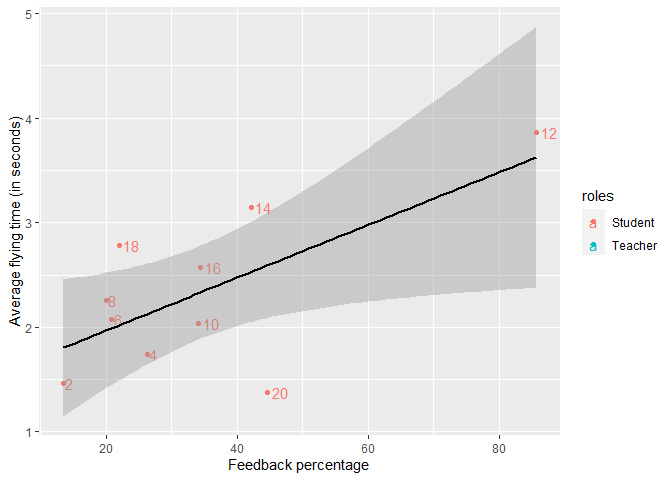

week8_DP
================
Cátia Reis
2022-06-20

-   [The coordination dataset](#the-coordination-dataset)
    -   [The variables](#the-variables)
    -   [Correlation](#correlation)
    -   [General Linear Model](#general-linear-model)
    -   [Plot](#plot)
-   [Final comment](#final-comment)

``` r
library(dplyr)
library(knitr)
library(ggplot2)
```

## The coordination dataset

We will be looking at the same dataset that we used in [week
6](https://github.com/kaktos2/Practicals/blob/b0359cddcbe321f9a0707f52a1e50e1533a206e6/DP_week6/DP_week6.md).

``` r
coordination<-read.table(file="coordination.csv", header=TRUE, sep=";",dec=",") 
coordination %>% kable()
```

| participants | roles   | distance1 | distance2 | distance3 | average_distance | time1 | time2 | time3 | average_flying_time | learning_time | feedback_percentage |
|-------------:|:--------|----------:|----------:|----------:|-----------------:|------:|------:|------:|--------------------:|--------------:|--------------------:|
|            1 | Teacher |       180 |       270 |       360 |           270.00 |  1.17 |  2.14 |  2.33 |                1.88 |          4.00 |                  NA |
|            2 | Student |       405 |       420 |       540 |           455.00 |  0.92 |  2.40 |  1.07 |                1.46 |          5.65 |               13.40 |
|            3 | Teacher |       760 |       430 |       430 |           540.00 |  2.66 |  2.23 |  2.23 |                2.37 |          7.75 |                  NA |
|            4 | Student |       420 |       240 |       280 |           313.33 |  1.80 |  1.97 |  1.46 |                1.74 |          8.42 |               26.28 |
|            5 | Teacher |       540 |       580 |       410 |           510.00 |  2.17 |  2.17 |  1.17 |                1.84 |         10.83 |                  NA |
|            6 | Student |       310 |       230 |       580 |           373.33 |  2.11 |  1.52 |  2.62 |                2.08 |          5.77 |               20.83 |
|            7 | Teacher |       220 |       450 |       210 |           293.33 |  1.41 |  2.18 |  1.78 |                1.79 |          4.43 |                  NA |
|            8 | Student |       500 |       550 |       230 |           426.66 |  2.42 |  2.15 |  2.20 |                2.26 |         11.28 |               20.00 |
|            9 | Teacher |       580 |       610 |       480 |           556.67 |  2.23 |  2.60 |  1.92 |                2.25 |          5.53 |                  NA |
|           10 | Student |       410 |       430 |       520 |           453.33 |  2.04 |  2.03 |  2.04 |                2.04 |          6.17 |               34.14 |
|           11 | Teacher |       770 |       530 |      1190 |           830.00 |  3.47 |  2.37 |  3.90 |                3.25 |         10.00 |                  NA |
|           12 | Student |       920 |      1100 |       790 |           936.67 |  4.13 |  4.65 |  2.79 |                3.86 |          5.45 |               85.71 |
|           13 | Teacher |       410 |       270 |       340 |           340.00 |  1.02 |  1.57 |  1.84 |                1.48 |         11.00 |                  NA |
|           14 | Student |       640 |       850 |       660 |           716.67 |  3.03 |  3.52 |  2.89 |                3.15 |          5.42 |               42.10 |
|           15 | Teacher |       260 |       300 |       220 |           260.00 |  3.25 |  2.85 |  2.90 |                3.00 |          4.80 |                  NA |
|           16 | Student |       320 |       320 |       300 |           313.33 |  2.82 |  2.35 |  2.55 |                2.57 |          6.72 |               34.37 |
|           17 | Teacher |       440 |       140 |       340 |           306.67 |  2.78 |  2.70 |  2.82 |                2.77 |          6.50 |                  NA |
|           18 | Student |       260 |       550 |       210 |           340.00 |  3.15 |  2.63 |  2.55 |                2.78 |          3.57 |               21.95 |
|           19 | Teacher |      1180 |       740 |       980 |           966.67 |  4.73 |  3.45 |  3.75 |                3.98 |          4.30 |                  NA |
|           20 | Student |       280 |       270 |       600 |           383.33 |  1.24 |  1.02 |  1.89 |                1.38 |          9.88 |               44.66 |

### The variables

-   Explanatory variables (as named in the dataset) : “roles” and
    “feedback_percentage”
-   Response variables : performance, i.e. “average_flying_time”&
    “average_distance”

### Correlation

I picked “average_flying_time” for our response variable in the formula
we are going to use but we could also be doing this with the
“average_distance” variable. Let’s see if they are or are not depedent.

``` r
cor.test(coordination$feedback_percentage,coordination$average_flying_time)
```

    ## 
    ##  Pearson's product-moment correlation
    ## 
    ## data:  coordination$feedback_percentage and coordination$average_flying_time
    ## t = 2.5573, df = 8, p-value = 0.03379
    ## alternative hypothesis: true correlation is not equal to 0
    ## 95 percent confidence interval:
    ##  0.07102417 0.91423603
    ## sample estimates:
    ##       cor 
    ## 0.6706595

There is a positive correlation between feedback percentage and the
average flying time of the paper plane. The p-value is below 0.05 which
tells us it is significant, thus, the variables are not independent.
However,correlation does not imply causation.

### General Linear Model

Let’s use the `lm()` function to study the relationship between the
variables.

``` r
general<-lm(coordination$feedback_percentage~coordination$average_flying_time)
summary(general)
```

    ## 
    ## Call:
    ## lm(formula = coordination$feedback_percentage ~ coordination$average_flying_time)
    ## 
    ## Residuals:
    ##     Min      1Q  Median      3Q     Max 
    ## -20.393  -8.473  -4.799   4.384  27.315 
    ## 
    ## Coefficients:
    ##                                  Estimate Std. Error t value Pr(>|t|)  
    ## (Intercept)                        -7.296     17.077  -0.427   0.6805  
    ## coordination$average_flying_time   17.856      6.982   2.557   0.0338 *
    ## ---
    ## Signif. codes:  0 '***' 0.001 '**' 0.01 '*' 0.05 '.' 0.1 ' ' 1
    ## 
    ## Residual standard error: 16.27 on 8 degrees of freedom
    ##   (10 observations deleted due to missingness)
    ## Multiple R-squared:  0.4498, Adjusted R-squared:  0.381 
    ## F-statistic:  6.54 on 1 and 8 DF,  p-value: 0.03379

Let’s add “learning_time” to our model and see if this is better…

``` r
general2<-lm(coordination$feedback_percentage~coordination$average_flying_time+coordination$learning_time)
summary(general2)
```

    ## 
    ## Call:
    ## lm(formula = coordination$feedback_percentage ~ coordination$average_flying_time + 
    ##     coordination$learning_time)
    ## 
    ## Residuals:
    ##     Min      1Q  Median      3Q     Max 
    ## -22.560  -6.139  -2.436   5.700  23.500 
    ## 
    ## Coefficients:
    ##                                  Estimate Std. Error t value Pr(>|t|)  
    ## (Intercept)                       -29.191     31.866  -0.916   0.3901  
    ## coordination$average_flying_time   20.843      8.004   2.604   0.0352 *
    ## coordination$learning_time          2.185      2.662   0.821   0.4388  
    ## ---
    ## Signif. codes:  0 '***' 0.001 '**' 0.01 '*' 0.05 '.' 0.1 ' ' 1
    ## 
    ## Residual standard error: 16.62 on 7 degrees of freedom
    ##   (10 observations deleted due to missingness)
    ## Multiple R-squared:  0.4981, Adjusted R-squared:  0.3547 
    ## F-statistic: 3.474 on 2 and 7 DF,  p-value: 0.08957

Well, it doesn’t seem like adding learning time adds anything
significant.

### Plot

Let’s make our “general” model visual.

``` r
ggplot(coordination,aes(feedback_percentage,average_flying_time,label=rownames(coordination),color=roles)) +
    geom_point() + labs(y ="Average flying time (in seconds)" , x = "Feedback percentage") + geom_text(hjust = -0.3)+geom_smooth(method = "lm", se = TRUE,color="black")  
```

    ## `geom_smooth()` using formula 'y ~ x'

    ## Warning: Removed 10 rows containing non-finite values (stat_smooth).

    ## Warning: Removed 10 rows containing missing values (geom_point).

    ## Warning: Removed 10 rows containing missing values (geom_text).

<!-- -->

With the summary of the model and this plot, we see that there is a
significant impact of feedback percentage on the performance of the
planes. But we also see that for example value 12 clearly pushes a bit
the line. Still, we can imagine that without it, the pattern would look
something a bit similar. There is also something interesting with number
12. All teachers (while teaching their student how to make the plane)
decided to do the paper plane at the same time as the student to show
them visually how to make it. However, number 12’s teacher decided
simply to give oral instructions and did not make a plane
simultaneously. So, this might explain why there is such a big
difference of feedback.

#### Some comments

-   For future research it would definitely be interesting to tell the
    teachers to only give oral instructions to the students.
-   Our sample size is too small so our measures might be lucky.
-   We measured “learning performance” by recording the performance of
    the paper planes. However, this measure might not be a good learning
    performance measure as there could be potential confounding
    variables.

## Final comment

Thank you for all the tools you gave us to learn. Hopefully these
practicals weren’t too boring.

Have a great summer !
